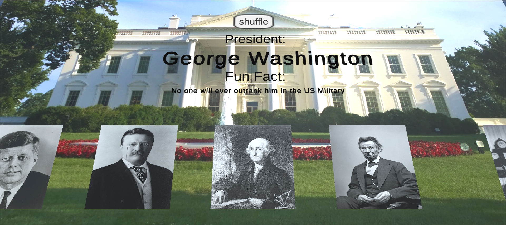

# Unity-PresidentsDay-echo3D-example
Learn about the 5 most popular presidents with this 3D shuffle trivia in Unity.

# Register
Don't have an API key? Make sure to register for FREE at [echo3D](https://console.echo3D.co/#/auth/register).

# Packages Used
* Unity 2020.3.26

# How to Play
Run the game and click shuffle and stop shuffle to view the different presidents and their fun facts.

# Setup
* Get your echo3D API key for free at [echo3D](https://medium.com/r/?url=https%3A%2F%2Fconsole.echo3d.co%2F%23%2Fauth%2Fregister)
* Clone the [repo](https://github.com/echo3Dco/Unity-PresidentsDay-echo3D-example)
* Install the echo3D [Unity SDK](https://docs.echo3d.co/unity/installation)
* Download the 3D models from the Models folder in the project
* Go to echo3D console and [click "Add to Cloud"](https://docs.echo3d.co/quickstart/add-a-3d-model) and upload the models
* Open the "scene" scene
* [Set the API key](https://docs.echo3d.co/quickstart/access-the-console) on the echo3D object in the Hierarchy using the the Inspector
* Play in Unity or [build and run the AR application](https://docs.echo3d.co/unity/adding-ar-capabilities#4-build-and-run-the-ar-application)

# Troubleshooting
* If images do not load from echo3D console and you get error: Security key not found or incorrect. Try this: Go to echo3D > console > Security > Secret Key > uncheck “Enable Secret Key”
* See other known issues here: https://docs.echo3d.co/unity/troubleshooting

# Learn More
Refer to our [documentation](https://docs.echo3D.co/unity/) to learn more about how to use Unity and echo3D.

# Support
Feel free to reach out at [support@echo3D.co](mailto:support@echo3D.co) or join our [support channel on Slack](https://go.echo3D.co/join).

## Screenshots

